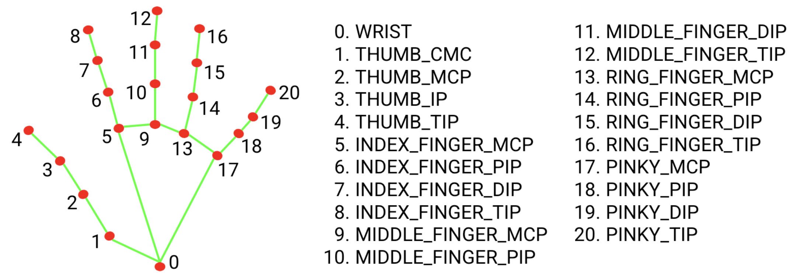

# Hand Gesture Mouse Control

Control your mouse cursor and trigger system actions using hand gestures captured from a webcam. This project uses [MediaPipePyTorch](https://github.com/zmurez/MediaPipePyTorch) (a PyTorch port of Google's MediaPipe hand-tracking models) to detect a hand in real time and map its landmarks to cursor movement and gesture-based commands.

## Features

- **Cursor control** — move the mouse by pointing your index finger; position is smoothed to reduce jitter.
- **Pinch to click** — bring your thumb and index fingertip together to trigger a left click.
- **Rock gesture to play/stop music** — form a "rock" hand sign (🤘) to start playing `music.mp3`; lower your hand to stop it.
- **Fist-hand screenshot** — bring all five fingertips close together to capture a screenshot of the camera preview window.
- **Gesture debouncing** — each gesture requires several consecutive detected frames before it's considered "active," reducing false triggers from noisy detection.
- **Live preview + recording** — shows the annotated camera feed with hand landmarks drawn on top, and records the session to `output.mp4`.
- **GPU acceleration** — automatically uses CUDA if available, otherwise falls back to CPU.

##  Hand Landmarkers


## How It Works

1. Each webcam frame is fed to a **BlazePalm** detector to locate hands.
2. Detected palm regions are passed to a **BlazeHandLandmark** regressor, which returns 21 3D landmarks per hand.
3. Landmark positions are used to:
   - Map the index fingertip to normalized screen coordinates for cursor movement.
   - Compute geometric relationships (distances between fingertips, wrist, and MCP joints) to classify gestures (pinch, rock sign, fingers-together).
4. A `GestureDebouncer` per gesture smooths out detection noise and reports clean rising/falling edges, which are used to fire actions (click, play/stop music, screenshot).

## Requirements

- Python 3.8+
- A webcam
- **Windows** (the screenshot and on-screen-keyboard-kill logic use `pygetwindow` and `taskkill`, which are Windows-specific)
- (Optional) NVIDIA GPU with CUDA for faster inference

### Python Dependencies

```
opencv-python
numpy
torch
pyautogui
pygame
pygetwindow
```

### MediaPipePyTorch

This project depends on the [MediaPipePyTorch](https://github.com/zmurez/MediaPipePyTorch) repository for the `BlazePalm` and `BlazeHandLandmark` models. Clone it into the project root:

```bash
git clone https://github.com/zmurez/MediaPipePyTorch.git
```

You'll also need the pretrained model weights and anchors, placed inside `MediaPipePyTorch/`:

- `blazepalm.pth`
- `anchors_palm.npy`
- `blazehand_landmark.pth`

## Setup

1. Clone this repository  (`MediaPipePyTorch` repository is already cloned in the MediaPipePyTorch folder) 
2. Install dependencies:
   ```bash
   pip install opencv-python numpy torch pyautogui pygame pygetwindow
   ```
3. Add an `music.mp3` audio file to the project's root folder (played on the rock gesture).
4. Run the script:
   ```bash
   python main.py
   ```
5. A window titled **"Camera"** will open showing your webcam feed with hand landmarks overlaid.
6. Press **`q`** to quit. The full session is saved to `output.mp4` in the project directory.

## Gesture Reference

| Gesture | Action |
|---|---|
| Point with index finger | Move cursor |
| Pinch (thumb + index tip together) | Left click |
| Rock sign 🤘 (thumb, middle, ring pinched; index & pinky extended) | Start playing music |
| Lower/remove hand while music plays | Stop music |
| All five fingertips brought together | Take a screenshot of the Camera window |


